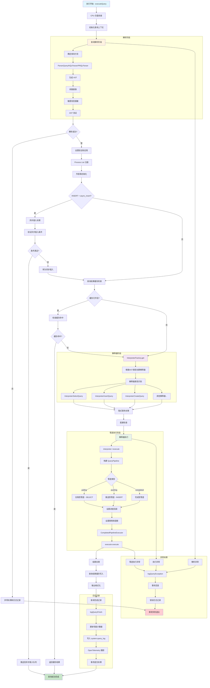

# executeQuery 流程设计



# InterpreterSetQuery::applySettingsFromQuery

executeQuery.cpp (1235 ~ 1236)

InterpreterSetQuery::applySettingsFromQuery 会递归遍历AST，查找所有ASTSetQuery节点，对于不同类型的查询（SELECT、INSERT、CREATE、EXPLAIN等），分别提取其SETTINGS子句，并立即调用InterpreterSetQuery::executeForCurrentContext()应用这些设置查询上下文中。

```cpp
if (out_ast)
{
    /// Interpret SETTINGS clauses as early as possible (before invoking the corresponding interpreter),
    /// to allow settings to take effect.
    InterpreterSetQuery::applySettingsFromQuery(out_ast, context);
    validateAnalyzerSettings(out_ast, settings[Setting::allow_experimental_analyzer]);
    ...
}
```

```sql
-- 示例1：SELECT查询中的SETTINGS
SELECT count(*) FROM table1 
SETTINGS max_threads = 4, use_index = 1;

-- 示例2：INSERT查询中的SETTINGS  
INSERT INTO table1 VALUES (1, 'a') 
SETTINGS max_insert_block_size = 1000;

-- 示例3：CREATE TABLE with SELECT中的嵌套SETTINGS
CREATE TABLE table2 AS 
SELECT * FROM table1 
SETTINGS max_memory_usage = 1000000;
```

# enforce_strict_identifier_format

executeQuery.cpp (1238 ~ 1244)

验证查询中的所有标识符（表名、列名、函数名等）是否符合严格的命名规范：

```cpp
if (settings[Setting::enforce_strict_identifier_format])
{
    WriteBufferFromOwnString buf;
    IAST::FormatSettings enforce_strict_identifier_format_settings(true);
    enforce_strict_identifier_format_settings.enforce_strict_identifier_format = true;
    out_ast->format(buf, enforce_strict_identifier_format_settings);
}
```

```sql
-- 符合严格标识符格式的查询
SELECT user_id, user_name FROM users_table;

-- 可能违反严格格式的查询（具体规则取决于配置）
SELECT `user-id`, `user name with spaces` FROM `table-with-dashes`;
SELECT 1abc, 2def FROM table; -- 以数字开头的标识符
```

- 创建一个带有enforce_strict_identifier_format = true的格式化设置
- 调用out_ast->format(buf, settings)重新格式化整个AST
- 如果AST中有不符合严格格式的标识符，格式化过程会抛出异常
- 这是一种验证机制，不会修改AST，只是检查合规性

# enable_global_with_statement

executeQuery.cpp (1256 ~ 1259)

```cpp
if (settings[Setting::enable_global_with_statement])
{
    ApplyWithGlobalVisitor::visit(out_ast);
}
```

使用了访问者模式对AST进行各种标准化处理，将WITH子句从父查询传播到所有子查询中

```sql
-- 原始查询
WITH users_summary AS (SELECT user_id, count(*) as cnt FROM users GROUP BY user_id)
SELECT * FROM (
    SELECT user_id FROM users_summary WHERE cnt > 10
    UNION ALL
    SELECT user_id FROM orders WHERE amount > 1000
);

-- 经过ApplyWithGlobalVisitor处理后，逻辑上等价于：
SELECT * FROM (
    WITH users_summary AS (SELECT user_id, count(*) as cnt FROM users GROUP BY user_id)
    SELECT user_id FROM users_summary WHERE cnt > 10
    UNION ALL
    WITH users_summary AS (SELECT user_id, count(*) as cnt FROM users GROUP BY user_id)  
    SELECT user_id FROM orders WHERE amount > 1000
);
```

- 从第一个SELECT查询中提取WITH表达式列表
- 递归遍历所有子查询（UNION、子查询、INTERSECT等）
- 将WITH表达式克隆并注入到每个子查询中
- 避免重复定义：如果子查询已有同名的WITH表达式，则不覆盖

# SelectIntersectExceptQueryVisitor

executeQuery.cpp (1261 ~ 1264)

```cpp
{
    SelectIntersectExceptQueryVisitor::Data data{settings[Setting::intersect_default_mode], settings[Setting::except_default_mode]};
    SelectIntersectExceptQueryVisitor{data}.visit(out_ast);
}
```

将 INTERSECT 和 EXCEPT 操作转换为标准的 AST 结构，处理默认行为

```sql
-- 原始查询 (使用默认模式)
SELECT id FROM table1 
INTERSECT 
SELECT id FROM table2 
EXCEPT 
SELECT id FROM table3;

-- 如果intersect_default_mode = DISTINCT, except_default_mode = ALL
-- 则转换为：
SELECT id FROM table1 
INTERSECT DISTINCT
SELECT id FROM table2 
EXCEPT ALL
SELECT id FROM table3;
```

- 根据设置将INTERSECT_DEFAULT转换为INTERSECT_ALL或INTERSECT_DISTINCT
- 根据设置将EXCEPT_DEFAULT转换为EXCEPT_ALL或EXCEPT_DISTINCT
- 重构AST结构，创建ASTSelectIntersectExceptQuery节点
- 处理操作符优先级（INTERSECT优先级高于EXCEPT）

# getDeserializedQueryPlan

executeQuery.cpp (1286 ~ 1288)

```cpp
std::shared_ptr<QueryPlanAndSets> query_plan;
if (stage == QueryProcessingStage::QueryPlan)
    query_plan = context->getDeserializedQueryPlan();
```

当查询处理阶段（stage）为 QueryProcessingStage::QueryPlan 时，说明需要从序列化数据中恢复查询计划，这通常发生在分布式查询中，远程节点将查询计划序列化后传递给其他节点。


