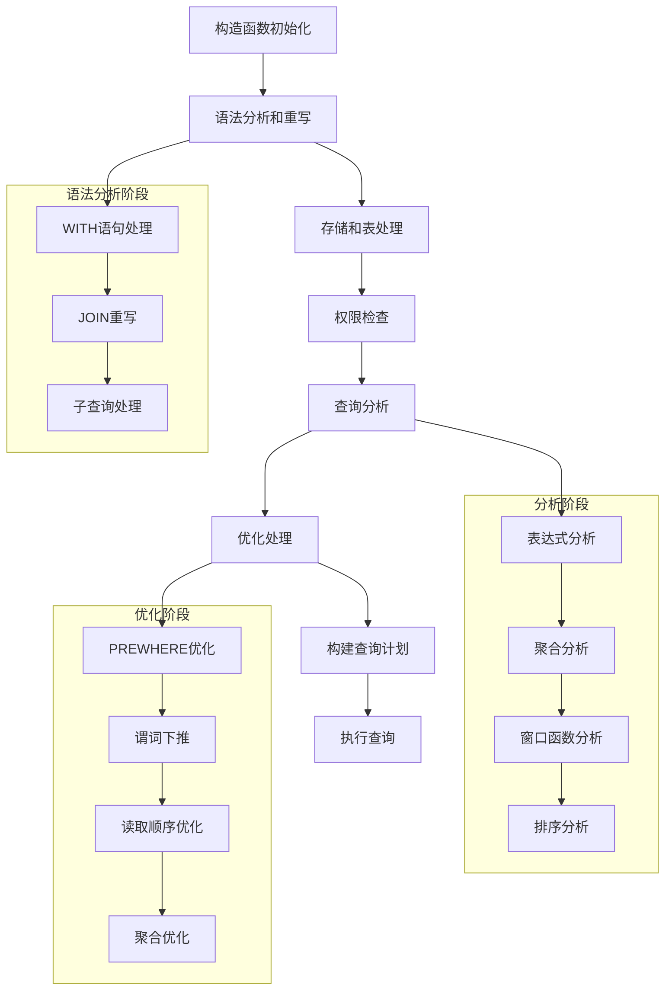
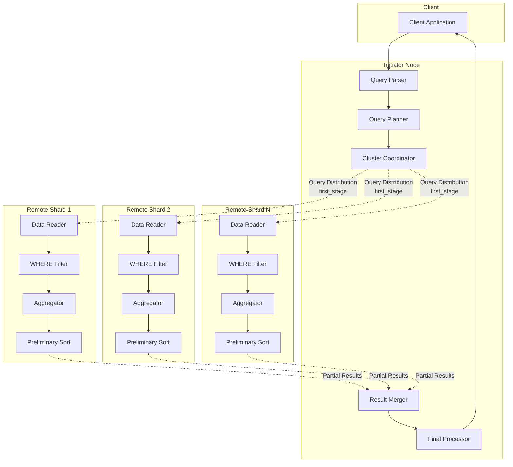
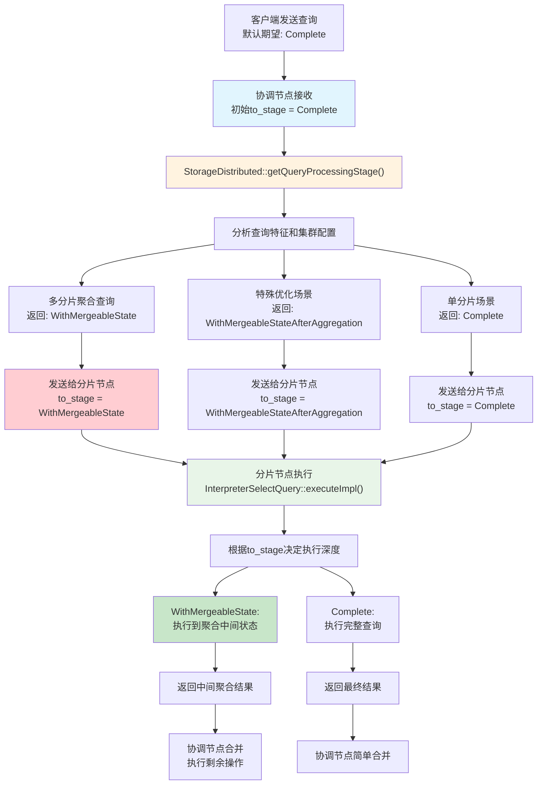
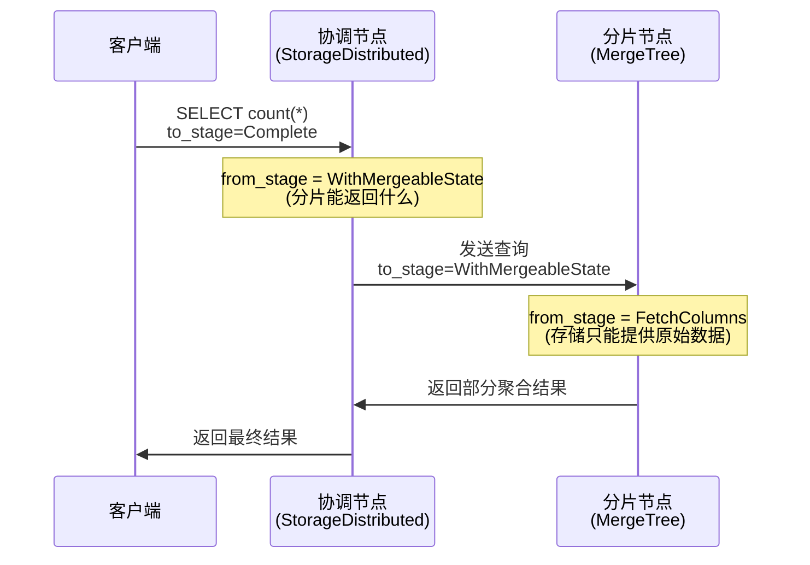

# InterpreterSelectQuery

InterpreterSelectQuery 是 ClickHouse 中负责解释和执行 SELECT 查询的核心组件，它将 SQL SELECT 语句转换为高效的查询执行计划。

采用管道化执行模型，将查询分解为多个可组合的处理步骤（Step），每个步骤负责特定的数据处理任务，形成高效的数据流水线。

```
InterpreterSelectQuery构造 → 分析与优化 → 构建查询计划 → 执行数据读取
```

```cpp
// 1. 创建解释器
auto interpreter = std::make_unique<InterpreterSelectQuery>(
    query_ast,           // SELECT AST 树
    context,             // 查询上下文
    options,             // 查询选项
    required_columns     // 需要的列名
);

// 2. 构建查询计划
QueryPlan query_plan;
interpreter->buildQueryPlan(query_plan);

// 3. 执行查询
BlockIO result = interpreter->execute();
```

buildQueryPlan 构建流程：

```cpp
// 1. 数据读取阶段
executeFetchColumns() → ReadFromMergeTree
// 2. 过滤阶段  
executeWhere() → FilterStep
// 3. 聚合阶段
executeAggregation() → AggregatingStep
// 4. HAVING过滤
executeHaving() → FilterStep  
// 5. 排序阶段
executeOrder() → SortingStep
// 6. 限制结果
executeLimit() → LimitStep
```



# 分布式读取流程

```
enum Enum
{
    FetchColumns       = 0,
    WithMergeableState = 1,
    Complete           = 2,
    WithMergeableStateAfterAggregation = 3,
    WithMergeableStateAfterAggregationAndLimit = 4,
}
```



# 节点状态变化图



典型聚合查询：

```sql
SELECT department, COUNT(*), AVG(salary) 
FROM distributed_employees 
GROUP BY department;
```

- 协调节点接收: to_stage = Complete
- 决策后分发: to_stage = WithMergeableState
- 分片执行: 执行到聚合中间状态
- 协调节点合并: 完成最终聚合

单分片查询：

```sql
SELECT * FROM distributed_table WHERE shard_key = 'specific_value';
```

- 协调节点接收: to_stage = Complete
- 决策后分发: to_stage = Complete (单分片优化)
- 分片执行: 完整执行查询
- 协调节点: 直接返回结果

分片键优化：

```sql
SELECT department, COUNT(*) 
FROM distributed_employees 
GROUP BY department  -- department是分片键
ORDER BY COUNT(*);
```

- 协调节点接收: to_stage = Complete
- 决策后分发: to_stage = WithMergeableStateAfterAggregation
- 分片执行: 完成聚合和排序
- 协调节点: 合并排序结果

aggregate_final 是聚合完成标志，决定了当前节点是否立即完成聚合函数计算，协调节点会根据分析结果指定分片节点的 to_stage，从而指导了分片节点是否需要进行聚合。

```
// 关键标志位：决定聚合函数是否立即完成
bool aggregate_final =
    expressions.need_aggregate &&
    options.to_stage > QueryProcessingStage::WithMergeableState &&  // 关键！
    !query.group_by_with_totals && !query.group_by_with_rollup && !query.group_by_with_cube;
```



# 节点调用链路

发起节点的调用链路：

```
1. Client 发送查询
   ↓
2. InterpreterSelectQuery::buildQueryPlan()
   ↓
3. InterpreterSelectQuery::executeImpl()
   ↓
4. InterpreterSelectQuery::executeFetchColumns()
   ↓
5. StorageDistributed::read()  // 不是真正读取数据！
   ↓
6. ClusterProxy::executeQuery()
   ↓
7. SelectStreamFactory::createForShard()
   ↓
8. RemoteQueryExecutor::sendQuery()  // 发送查询给分片节点
   ↓
9. 等待分片节点返回中间结果
   ↓
10. 执行 second_stage：合并、排序、LIMIT
```

- 发起节点执行的 `storage->read(...)` 底层是在通过 `StorageDistributed` 分发请求给分片节点

分片节点的调用链路

```
1. 接收到发起节点的查询请求
   ↓
2. InterpreterSelectQuery::buildQueryPlan()
   ↓
3. InterpreterSelectQuery::executeImpl()
   ↓
4. InterpreterSelectQuery::executeFetchColumns()
   ↓
5. StorageReplicatedMergeTree::read()  // 真正读取本地数据！
   ↓
6. MergeTreeDataSelectExecutor::read()
   ↓
7. 执行 first_stage：WHERE、聚合等
   ↓
8. 返回中间结果给发起节点
```

# FetchColumns


```
// 1. 查询解释器入口
InterpreterSelectQuery::executeImpl()
    └─> InterpreterSelectQuery::executeFetchColumns()
        └─> storage->read()  // 调用具体存储引擎的 read 方法

// 2. MergeTree 存储引擎处理
StorageMergeTree::read()
    └─> reader.read()  // MergeTreeDataSelectExecutor
        └─> MergeTreeDataSelectExecutor::read()
            └─> MergeTreeDataSelectExecutor::readFromParts()
                └─> new ReadFromMergeTree()  // 创建查询计划步骤
                    └─> query_plan.addStep()

// 3. 管道初始化
ReadFromMergeTree::initializePipeline()
    └─> getAnalysisResult()  // 分析查询，选择分片和范围
        └─> selectRangesToRead()  // 选择要读取的数据范围
            └─> 创建具体的处理器
                ├─> MergeTreeThreadSelectProcessor (并行读取)
                ├─> MergeTreeInOrderSelectProcessor (顺序读取)
                └─> MergeTreeReverseSelectProcessor (逆序读取)

// 4. 数据处理器执行
MergeTreeThreadSelectProcessor::generate()
    └─> readFromPart()
        └─> reader->readRows()  // 从 Part 读取数据
            └─> IMergeTreeReader::readRows()
                └─> 返回 Block 数据
```

## 优化小计数查询

针对简单的 `SELECT count()` 查询，会直接从存储元数据获取行数 

```sql
-- 这类查询会触发优化
SELECT count() FROM users; -- 从 storage->totalEffectiveRows() 中读取
SELECT count() FROM users WHERE date = '2023-01-01';  -- 仅分区谓词，从 storage->totalRowsByPartitionPredicate() 中读取
```

## 列数限制检查

```cpp
if (!options.only_analyze && settings.max_columns_to_read && 
    required_columns.size() > settings.max_columns_to_read)
    throw Exception(ErrorCodes::TOO_MANY_COLUMNS, /*...*/);
```

## 线程数和流数配置

```cpp
size_t max_threads_execute_query = settings.max_threads;

// 分布式查询特殊处理
if (storage && storage->isRemote()) {
    is_remote = true;
    max_threads_execute_query = max_streams = settings.max_distributed_connections;
}

// 本地存储：增加流数以更好地利用多线程
if (max_streams > 1 && !is_remote)
    max_streams *= settings.max_streams_to_max_threads_ratio;
```

## 块大小优化

针对简单LIMIT查询的优化：

```cpp
// 例：SELECT * FROM table LIMIT 100
if (!query.distinct && !query.limit_with_ties && !query.prewhere() && 
    !query.where() && !query.groupBy() && !query.having() && 
    !query.orderBy() && !query.limitBy() && query.limitLength() && 
    !query_analyzer->hasAggregation() && !query_analyzer->hasWindow() && 
    limit_length + limit_offset < max_block_size)
{
    // 优化：只读取需要的数据量
    max_block_size = std::max(UInt64{1}, limit_length + limit_offset);
    max_threads_execute_query = max_streams = 1;
}
```

## 数据源初始化


### 已准备的输入（Prepared Input）

当 query_plan.isInitialized() 返回 true 时，说明QueryPlan已经有了初始的数据源。

```cpp
if (query_plan.isInitialized()) {
    /// Prepared input - 已经有数据源了
}
```

场景1：WITH子句中的公共表表达式（CTE）

```sql
WITH users_with_high_score AS (
    SELECT user_id, score FROM game_scores WHERE score > 1000
)
SELECT u.user_id, u.score, p.name
FROM users_with_high_score u
JOIN user_profiles p ON u.user_id = p.user_id;
```

- 在这个例子中，当处理主查询时，users_with_high_score 的QueryPlan已经被构建好了。

场景2：多层嵌套查询的内层处理

```sql
SELECT outer_col FROM (
    SELECT inner_col as outer_col FROM (
        SELECT base_col as inner_col FROM base_table  -- 最内层
    ) inner_query
) outer_query;
```

- 当处理中间层查询时，最内层的QueryPlan已经准备好。

场景3：Union查询的分支处理

```sql
SELECT id, name FROM table1
UNION ALL
SELECT id, name FROM table2;  -- 第二个分支的QueryPlan可能已被准备
```

### 子查询（Subquery）

```cpp
else if (interpreter_subquery) {
    // 提取子查询AST
    ASTPtr subquery = extractTableExpression(query, 0);
    if (!subquery)
        throw Exception("Subquery expected", ErrorCodes::LOGICAL_ERROR);
    
    // 创建子查询解释器
    interpreter_subquery = std::make_unique<InterpreterSelectWithUnionQuery>(
        subquery, 
        getSubqueryContext(context),  // 使用特殊的子查询上下文
        options.copy().subquery().noModify(), 
        required_columns);
    
    // 如果主查询有聚合，忽略子查询的TOTALS
    if (query_analyzer->hasAggregation())
        interpreter_subquery->ignoreWithTotals();
    
    // 递归构建子查询的QueryPlan
    interpreter_subquery->buildQueryPlan(query_plan);
    query_plan.addInterpreterContext(context);
}
```

```sql
SELECT * FROM (
    SELECT user_id, sum(amount) as total 
    FROM transactions 
    GROUP BY user_id
) WHERE total > 1000;
```

### 存储表读取（Table Storage）

```cpp
else if (storage) {
    // 设置PREWHERE信息
    if (prewhere_info)
        query_info.prewhere_info = prewhere_info;
    
    // 配置读取优化器
    bool optimize_read_in_order = analysis_result.optimize_read_in_order;
    bool optimize_aggregation_in_order = analysis_result.optimize_aggregation_in_order;
    
    if (optimize_read_in_order || optimize_aggregation_in_order) {
        if (optimize_read_in_order) {
            // ORDER BY优化
            query_info.order_optimizer = std::make_shared<ReadInOrderOptimizer>(
                query,
                analysis_result.order_by_elements_actions,
                getSortDescription(query, context),
                query_info.syntax_analyzer_result);
        } else {
            // GROUP BY优化
            query_info.order_optimizer = std::make_shared<ReadInOrderOptimizer>(
                query,
                analysis_result.group_by_elements_actions,
                getSortDescriptionFromGroupBy(query),
                query_info.syntax_analyzer_result);
        }
        
        // 计算输入顺序信息
        UInt64 limit = (query.hasFiltration() || query.groupBy()) ? 0 : getLimitForSorting(query, context);
        query_info.input_order_info = query_info.order_optimizer->getInputOrder(
            metadata_snapshot, context, limit);
    }

    // 调用存储的read方法
    storage->read(query_plan, required_columns, storage_snapshot, query_info, 
                  context, processing_stage, max_block_size, max_streams);
}
```

## 读取优化设置

ReadInOrderOptimizer 用于优化 ORDER BY 和 GROUP BY 

```cpp
if (optimize_read_in_order) {
    query_info.order_optimizer = std::make_shared<ReadInOrderOptimizer>(
        query,
        analysis_result.order_by_elements_actions,
        getSortDescription(query, context),
        query_info.syntax_analyzer_result);
    
    // 计算输入顺序信息
    query_info.input_order_info = query_info.order_optimizer->getInputOrder(
        metadata_snapshot, context, limit);
}
```

```sql
-- 如果表按 (date, user_id) 排序
SELECT * FROM events ORDER BY date, user_id LIMIT 1000;
-- 优化器会利用已有的排序，避免额外排序
```

聚合顺序优化

```cpp
if (optimize_aggregation_in_order) {
    query_info.order_optimizer = std::make_shared<ReadInOrderOptimizer>(
        query,
        analysis_result.group_by_elements_actions,
        getSortDescriptionFromGroupBy(query),
        query_info.syntax_analyzer_result);
}
```

## 配额和限制设置

```cpp
StreamLocalLimits limits;
SizeLimits leaf_limits;
std::shared_ptr<const EnabledQuota> quota;

if (!options.ignore_limits) {
    limits = getLimitsForStorage(settings, options);
    leaf_limits = SizeLimits(settings.max_rows_to_read_leaf, 
                            settings.max_bytes_to_read_leaf, 
                            settings.read_overflow_mode_leaf);
}

if (!options.ignore_quota && (options.to_stage == QueryProcessingStage::Complete))
    quota = context->getQuota();

// 添加限制和配额步骤
auto adding_limits_and_quota = std::make_unique<SettingQuotaAndLimitsStep>(
    query_plan.getCurrentDataStream(), storage, std::move(table_lock), 
    limits, leaf_limits, std::move(quota), context);
query_plan.addStep(std::move(adding_limits_and_quota));
```

## 表别名处理

```sql
-- 表定义中的ALIAS列
CREATE TABLE users (
    id UInt64,
    name String,
    full_name String ALIAS concat(first_name, ' ', last_name)
);

SELECT full_name FROM users;  -- 需要计算别名表达式
```

```cpp
if (processing_stage == QueryProcessingStage::FetchColumns && alias_actions) {
    auto table_aliases = std::make_unique<ExpressionStep>(
        query_plan.getCurrentDataStream(), alias_actions);
    table_aliases->setStepDescription("Add table aliases");
    query_plan.addStep(std::move(table_aliases));
}
```

# ReadFromRemote


协调节点上构建的 QueryPlan 采用的是 ReadFromRemote，用于通信分片节点。

```cpp
void ReadFromRemote::initializePipeline(QueryPipelineBuilder & pipeline, const BuildQueryPipelineSettings &)
{
    Pipes pipes;
    
    // 为每个分片创建数据读取管道
    for (const auto & shard : shards)
    {
        if (shard.lazy)
            addLazyPipe(pipes, shard, /*coordinator=*/nullptr, /*pool*/{}, /*replica_info*/std::nullopt);
        else
            addPipe(pipes, shard, /*coordinator=*/nullptr, /*pool*/{}, /*replica_info*/std::nullopt);
    }
    
    // 合并所有分片的结果流
    auto pipe = Pipe::unitePipes(std::move(pipes));
    pipeline.init(std::move(pipe));
}
```

```cpp
void RemoteQueryExecutor::sendQuery(ClientInfo::QueryKind query_kind)
{
    connections = create_connections();  // 建立到远程分片的连接
    
    // 发送查询到远程分片
    connections->sendQuery(timeouts, query, query_id, stage, modified_client_info, true);
    
    // 发送标量子查询结果和外部表
    if (settings.enable_scalar_subquery_optimization)
        sendScalars();
    sendExternalTables();
}

Block RemoteQueryExecutor::read()
{
    while (true)
    {
        Packet packet = connections->receivePacket();
        
        if (auto block = processPacket(std::move(packet)))
            return *block;  // 返回接收到的数据块
    }
}
```

分片节点上构建的 QueryPlan 则是 ReadFromMergeTree，用于从本地读取数据。

```cpp
void InterpreterSelectQuery::executeFetchColumns(QueryProcessingStage::Enum processing_stage, QueryPlan & query_plan)
{
    // 在分片节点上，storage 就是本地的 MergeTree 存储
    if (storage)
    {
        // 调用 storage->read() 创建本地读取计划
        storage->read(query_plan, required_columns, storage_snapshot, query_info, 
                     context, processing_stage, max_block_size, max_streams);
        
        // 这里实际上会创建 ReadFromMergeTree Step
    }
}
```

# MergeTreeDataSelectExecutor::read

MergeTreeDataSelectExecutor::read 是 ClickHouse MergeTree 存储引擎查询执行的核心函数，负责将 SQL 查询转换为可执行的查询计划。让我通过简化的伪代码来详细解析其功能：

```cpp
// 核心功能：将查询请求转换为QueryPlan，支持普通查询和投影查询
QueryPlanPtr MergeTreeDataSelectExecutor::read(查询参数...) {
    // 1. 前置检查和优化设置
    // 2. 根据是否有投影分两种处理方式
    // 3. 返回可执行的查询计划
}
```

```cpp
QueryPlanPtr MergeTreeDataSelectExecutor::read(
    column_names_to_return,     // 需要返回的列名
    storage_snapshot,           // 存储快照
    query_info,                 // 查询信息
    context,                    // 查询上下文
    max_block_size,             // 最大块大小
    num_streams,                // 并行流数量
    processed_stage,            // 处理阶段
    max_block_numbers_to_read,  // 最大块号限制
    enable_parallel_reading     // 是否启用并行读取
) {
    // 第一阶段：前置检查
    if (query_info.merge_tree_empty_result) {
        return 空的QueryPlan();  // 查询结果为空，直接返回
    }
    
    // 第二阶段：优化设置
    if (data.getSettings()->order_by_mode != SortingMode::NORMAL) {
        // 对于curve order，禁用read in order优化
        query_info.input_order_info = nullptr;
    }
    
    // 第三阶段：获取基础数据
    metadata_for_reading = storage_snapshot->getMetadataForQuery();
    parts = storage_snapshot->data.parts;  // 获取所有数据分片
    
    // 第四阶段：分支处理
    if (!query_info.projection) {
        // 情况1：普通查询（无投影
        auto plan = readFromParts(...)
    } else {
        // 情况2：投影查询
        ...
    }
}
```

```
InterpreterSelectQuery::execute()
        ↓
    StorageMergeTree::read()
            ↓
        MergeTreeDataSelectExecutor::read()
                ↓
            MergeTreeDataSelectExecutor::readFromParts()
                    ↓
                ReadFromMergeTree

ISourceStep::updatePipeline()
        ↓
    ReadFromMergeTree::initializePipeline()
            ↓
        ReadFromMergeTree::selectRangesToRead()  // 选择读取范围
            ↓
        MergeTreeDataSelectExecutor::filterPartsByPrimaryKeyAndSkipIndexes()  // 主键和跳数索引过滤
            ↓
        MergeTreeDataSelectExecutor::filterPartsByPartition()  // 分区过滤
            ↓
        ReadFromMergeTree::read()  // 实际数据读取
```

# ReadFromMergeTree::initializePipeline

