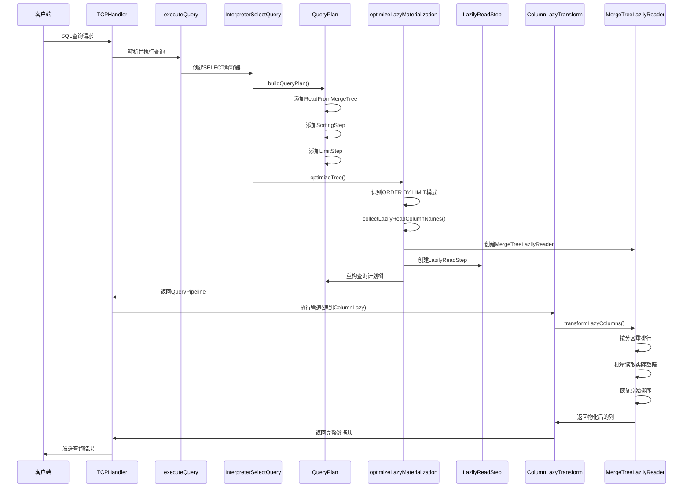

# Lazy Materialization




# SourceStepWithFilter::applyPrewhereActions

我来详细分析`SourceStepWithFilter::applyPrewhereActions`函数的每一个步骤，并通过具体示例展示执行过程中的变量值变化。
Ran tool
Ran tool

Ran tool
Ran tool
Ran tool

基于对源码的深入分析，我来详细解析`SourceStepWithFilter::applyPrewhereActions`函数的每一个步骤，并通过具体示例展示执行过程。

## 函数结构分析

首先，让我们了解`PrewhereInfo`的结构：

```cpp
struct PrewhereInfo
{
    std::optional<ActionsDAG> row_level_filter;  // 行级安全过滤器
    ActionsDAG prewhere_actions;                 // PREWHERE操作DAG
    String row_level_column_name;                // 行级过滤器列名
    String prewhere_column_name;                 // PREWHERE条件列名  
    bool remove_prewhere_column = false;         // 是否移除PREWHERE列
    bool need_filter = false;                    // 是否需要过滤
    bool generated_by_optimizer = false;         // 是否由优化器生成
};
```

## 具体示例场景

假设我们有以下SQL查询：
```sql
SELECT user_id, name, salary 
FROM employees 
WHERE salary > 50000 AND department = 'Engineering'
```

其中：
- `salary > 50000` 被优化为PREWHERE条件
- 表有行级安全策略：只能看到自己部门的数据

## 输入参数示例

```cpp
// 输入的Block header（来自存储的原始列结构）
Block input_block = {
    {"user_id", DataTypeUInt64()},
    {"name", DataTypeString()},
    {"salary", DataTypeUInt64()}, 
    {"department", DataTypeString()},
    {"_part_offset", DataTypeUInt64()}
};

// PrewhereInfo配置
PrewhereInfoPtr prewhere_info = std::make_shared<PrewhereInfo>();
prewhere_info->row_level_filter = row_security_dag;  // 行级安全DAG
prewhere_info->row_level_column_name = "__row_level_filter_result";
prewhere_info->prewhere_actions = salary_filter_dag;  // salary > 50000的DAG
prewhere_info->prewhere_column_name = "__prewhere_condition";
prewhere_info->remove_prewhere_column = true;
prewhere_info->need_filter = false;
```

## 逐步执行过程分析

### 步骤1：函数入口检查

```cpp
Block SourceStepWithFilter::applyPrewhereActions(Block block, const PrewhereInfoPtr & prewhere_info)
{
    // 执行前的变量状态
    // block = {user_id:UInt64, name:String, salary:UInt64, department:String, _part_offset:UInt64}
    // prewhere_info != nullptr
    
    if (prewhere_info)  // 条件为true，进入处理逻辑
    {
```

**此时变量值：**
- `block.columns() = 5`
- `block` 包含所有原始列

### 步骤2：处理行级安全过滤器

```cpp
        if (prewhere_info->row_level_filter)  // 假设存在行级过滤器
        {
            // 执行前状态
            // block = {user_id, name, salary, department, _part_offset}
            
            block = prewhere_info->row_level_filter->updateHeader(block);
            
            // 执行后状态  
            // block = {user_id, name, salary, department, _part_offset, __row_level_filter_result:UInt8}
            
            auto & row_level_column = block.getByName(prewhere_info->row_level_column_name);
            // row_level_column.name = "__row_level_filter_result"
            // row_level_column.type = DataTypeUInt8 (布尔类型)
            
            if (!row_level_column.type->canBeUsedInBooleanContext())
            {
                // 验证该列类型可以用作布尔条件，UInt8可以，所以不会抛异常
            }

            block.erase(prewhere_info->row_level_column_name);
            // 执行后状态
            // block = {user_id, name, salary, department, _part_offset}
            // __row_level_filter_result列被删除
        }
```

**此时变量值：**
- `block.columns() = 5` (回到原来的列数)
- 行级过滤器列已被应用并删除

### 步骤3：处理PREWHERE条件

```cpp
        {
            // 执行前状态
            // block = {user_id, name, salary, department, _part_offset}
            
            block = prewhere_info->prewhere_actions.updateHeader(block);
            
            // 执行后状态（salary > 50000的计算结果被添加）
            // block = {user_id, name, salary, department, _part_offset, __prewhere_condition:UInt8}
            
            auto & prewhere_column = block.getByName(prewhere_info->prewhere_column_name);
            // prewhere_column.name = "__prewhere_condition"
            // prewhere_column.type = DataTypeUInt8
            // prewhere_column.column = nullptr (header模式下为空)
            
            if (!prewhere_column.type->canBeUsedInBooleanContext())
            {
                // UInt8可以用作布尔条件，所以不会抛异常
            }
```

**此时变量值：**
- `block.columns() = 6`
- `prewhere_column` 指向`__prewhere_condition`列

### 步骤4：决定PREWHERE列的处理方式

```cpp
            if (prewhere_info->remove_prewhere_column)  // true
            {
                block.erase(prewhere_info->prewhere_column_name);
                // 执行后状态
                // block = {user_id, name, salary, department, _part_offset}
                // __prewhere_condition列被删除
            }
            else if (prewhere_info->need_filter)  // 不会执行这个分支
            {
                // ... 这里的代码不会执行
            }
        }
```

**此时变量值：**
- `block.columns() = 5` (PREWHERE列被删除)
- 最终block结构与输入时相同，但经过了PREWHERE处理

### 步骤5：返回结果

```cpp
    return block;
    // 最终返回的block = {user_id:UInt64, name:String, salary:UInt64, department:String, _part_offset:UInt64}
}
```

## 特殊情况：need_filter为true的处理

如果`prewhere_info->need_filter = true`且`remove_prewhere_column = false`，会执行更复杂的逻辑：

```cpp
else if (prewhere_info->need_filter)  // 假设为true
{
    if (const auto * type = typeid_cast<const DataTypeNullable *>(prewhere_column.type.get()); 
        type && type->onlyNull())
    {
        // 如果是纯Null类型
        prewhere_column.column = prewhere_column.type->createColumnConst(block.rows(), Null());
    }
    else
    {
        WhichDataType which(removeNullable(recursiveRemoveLowCardinality(prewhere_column.type)));
        // which 分析 prewhere_column 的实际数据类型
        
        if (which.isNativeInt() || which.isNativeUInt())
        {
            // 对于整数类型，创建值为1的常量列
            prewhere_column.column = prewhere_column.type->createColumnConst(block.rows(), 1u)->convertToFullColumnIfConst();
            // 示例：如果block.rows() = 1000，创建1000行都是1的UInt8列
        }
        else if (which.isFloat())
        {
            // 对于浮点类型，创建值为1.0的常量列  
            prewhere_column.column = prewhere_column.type->createColumnConst(block.rows(), 1.0f)->convertToFullColumnIfConst();
        }
        else
        {
            // 不支持的类型会抛异常
            throw Exception(ErrorCodes::ILLEGAL_TYPE_OF_COLUMN_FOR_FILTER, ...);
        }
    }
}
```

## 总结

`applyPrewhereActions`函数的执行流程：

1. **验证输入**：检查prewhere_info是否存在
2. **处理行级安全**：应用行级过滤器并清理临时列
3. **应用PREWHERE**：执行PREWHERE条件计算
4. **清理或保留**：根据配置决定是否保留PREWHERE结果列
5. **类型验证**：确保所有过滤列都能用作布尔条件

这个函数的核心作用是将查询优化器生成的PREWHERE条件正确地应用到block header上，为后续的实际数据处理做好准备。通过这种方式，ClickHouse能够在header阶段就确定最终的列结构，避免运行时的结构不匹配问题。