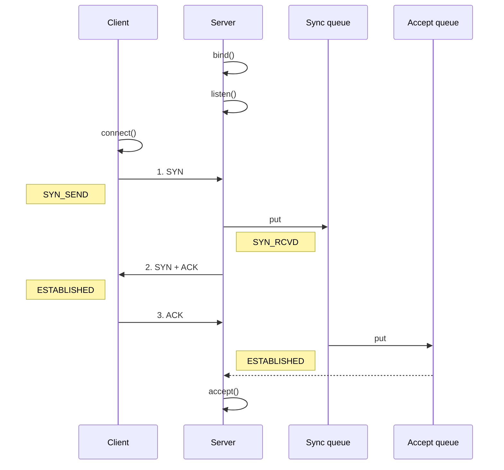

# Option

通过 Bootstrap#option 给当前 SocketChannel 配置 Option, 作用于整个 Pipeline

```java
bootstrap.option(ChannelOption.CONNECT_TIMEOUT_MILLIS, 5000);
```

通过 Bootstrap#childOption 给当前 ServerSocketChannel 的 SocketChannel 配置 Option, 作用于所有的 Pipeline

```java
serverBootstrap.childOption(ChannelOption.CONNECT_TIMEOUT_MILLIS, 5000);
```

通过 Channel#setOption 配置 Option, 作用于当前 Pipeline

```java
ch.pipeline().addLast(new MyServerHandler());
ch.config().setOption(ChannelOption.SO_BACKLOG, 128);
```

# CONNECT_TIMEOUT_MILLIS

CONNECT_TIMEOUT_MILLIS 是 Netty 中用于控制连接建立的等待时间, 表示连接超时的毫秒数

- SO_TIMEOUT 是针对于传统的 BIO 中 Socket 的读取数据的超时时间

```java
bootstrap.option(ChannelOption.CONNECT_TIMEOUT_MILLIS, 5000);
```

在 AbstractNioChannel#connect() 中的这段代码实现了 CONNECT_TIMEOUT_MILLIS 超时抛出异常的功能, 非常牛, 值得学习

```java
public ChannelFuture connect(SocketAddress remoteAddress) {
    // 创建 ChannelFuture Obj 和 ChannelPromise Obj, 他们两都是用于处理连接操作的异步结果和状态, 只是 ChannelPromise Obj 可以多了一个状态标记的功能
    ChannelFuture future = new DefaultChannelPromise(channel, ImmediateEventExecutor.INSTANCE);
    ChannelPromise promise = (ChannelPromise) future;

    // 开始连接
    connect(remoteAddress, null, promise);

    // 从 config() 中获取我们配置的 CONNECT_TIMEOUT_MILLIS Option
    int connectTimeoutMillis = config().getConnectTimeoutMillis();
    
    // 如果 connectTimeoutMillis > 0, 就说明开启了超时异常处理
    if (connectTimeoutMillis > 0) {
        // 定时任务, 到达指定时间后, 就判断有没有执行完任务, 如果没有执行完, 就抛异常
        ScheduledFuture<?> timeoutFuture = eventLoop.schedule(() -> {
            // 如果 promise 还没有执行结束, 就说明超时了, 抛异常
            if (!promise.isDone()) {
                promise.tryFailure(new ConnectTimeoutException("Connection timed out"));
            }
        }, connectTimeoutMillis, TimeUnit.MILLISECONDS);

        // 如果执行完了任务, 就执行这里的回掉函数, 尝试去取消上面的定时任务
        promise.addListener(future -> timeoutFuture.cancel(false));
    }

    return future;
}
```

# SO_BACKLOG

TCP 三次握手中, 会用 Sync Queue (半连接队列) 和 Accept Queue (全连接队列) 来存放连接状态

- 第一次握手后, 会将连接存放到 Sync Queue 中
- 第三次握手后, 会将连接从 Sync Queue 移动到 Accept Queue 中
- Server 后续通过 accept() 从 Accept Queue 中取出连接进行处理



Linux 通过 /proc/sys/net/ipv4/tcp_max_syn_backlog 配置 Sync Queue 的大小

- 在 Syncookies 启用的情况下, 逻辑上没有最大值限制, 这个设置便被忽略

Linux 通过 /proc/sys/net/core/somaxconn 配置 Accept Queue 的大小

- Server 处理连接的能力是有限的, 所以每次都是先将连接存放在 Accept Queue 中, 然后通过 accept() 来获取连接进行处理
- 如果 Accept Queue 塞满了, Server 将发送一个拒绝连接的错误信息到 Client, 所以正常应该设置的大一点

Netty 通过 ServerBootstrap#option() 配置 Accept Queue 的大小

- Linux 和 Netty 都可以配置 Accept Queue 的大小, 默认是两者取一个小的

```java
serverBootstrap.option(ChannelOption.SO_BACKLOG, 3);
```

# TCP_NODELAY

TCP 协议在发送数据时通常会进行 Nagle 算法的处理, 将小的数据块合并成一个大的数据块后再发送, 以减少网络传输的次数, 提高网络的利用率

Netty 可以配置 TCP_NODELAY 控制是否启用 Nagle 算法, 当 TCP_NODELAY 被设置为 true 时, 表示禁用 Nagle 算法, 数据将会立即发送而不进行合并

```java
bootstrap.option(ChannelOption.TCP_NODELAY, true)
```

# SO_SNDBUF, SO_RCVBUF

SO_SENDBUF 和 SO_RCVBUF 是两个用于控制 Socket 缓冲区大小的参数

```java
bootstrap.option(ChannelOption.SO_SNDBUF, 1024); // 设置发送缓冲区大小为 1024B
bootstrap.option(ChannelOption.SO_RCVBUF, 2048); // 设置接收缓冲区大小为 2048B
```

# ALLOCATOR

ALLOCATOR 负责管理 Netty 中所有的内存分配和释放操作, 包括 ByteBuf Obj 的创建和销毁, 是 Netty 中实现零拷贝的关键, 通过对内存的高效管理, 可以减少内存碎片化和频繁的内存分配操作, 提高网络应用的性能和吞吐量

通过 ALLOCATOR 指定 ByteBufAllocator 的类型

```java
bootstrap.option(ChannelOption.ALLOCATOR, PooledByteBufAllocator.DEFAULT);
```

还可以通过 JDK VM Option 指定 ByteBufAllocator 是否采用 Pool, 是否采用 Direct Memory

- 通过 `-Dio.netty.allocator.type=unpooled` 指定采用 UnPooled
- 通过 `-Dio.netty.noPreferDirect=false` 指定采用 Direct Memory

# RCVBUF_ALLOCATOR

RCV_BUFALLOCATOR 用于控制如何分配数据的缓冲区, 该缓冲区用于存储从网络中接收到的数据

- ALLOCATOR 配置控制整个 Netty 应用中的 ByteBuf 的分配方式, 包括但不限于接收缓冲区

配置自适应接收缓冲区分配器

- 这是 Netty 默认的缓冲区分配器, 它会自动调整缓冲区的大小以响应不同的负载情况, 旨在减少内存占用和避免数据分段, 自适应分配器会根据实际读取的数据量动态调节下一次读操作的缓冲区大小

```java
bootstrap.option(ChannelOption.RCVBUF_ALLOCATOR, AdaptiveRecvByteBufAllocator.DEFAULT);
```

配置固定大小的接收缓冲区分配器

- 这种分配器为 Netty 的每个读操作分配一个固定大小的缓冲区, 它适用于那些消息大小相对固定的场景, 能够有效减少缓冲区调整的开销

```java
bootstrap.option(ChannelOption.RCVBUF_ALLOCATOR, new FixedRecvByteBufAllocator(2048));
```

# ulimit

ulimit 可以控制用户能够创建的进程数量, 打开的文件描述符数量, 单个进程的内存限制等

查看当前系统的 ulimit 参数

```shell
ulimit -a
```

临时设置 ulimit 参数

```shell
ulimit -n <value>   # 设置文件描述符数量限制
ulimit -u <value>   # 设置进程数量限制
```

永久性设置 ulimit 参数 (file: /etc/security/limits.conf)

- soft 表示软限制, hard 表示硬限制, soft 是实际生效的限制值, hard 是 soft 的上限
- 修改完, 需要重新登录系统才能生效

```shell
soft nofile <value>   # 设置文件描述符数量限制
soft nproc <value>    # 设置进程数量限制
hard nofile <value>
hard nproc <value>
```

